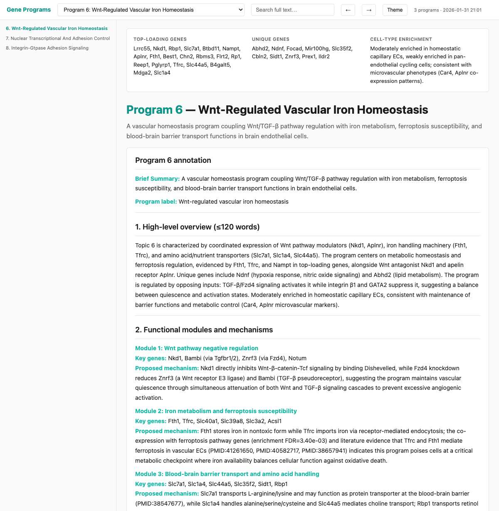
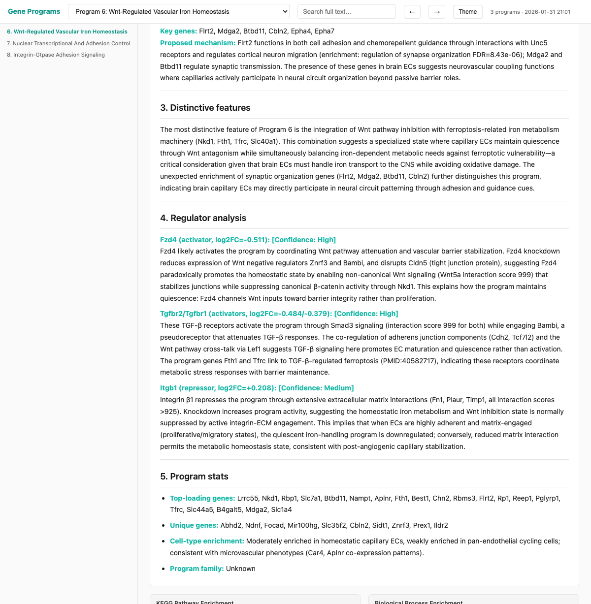
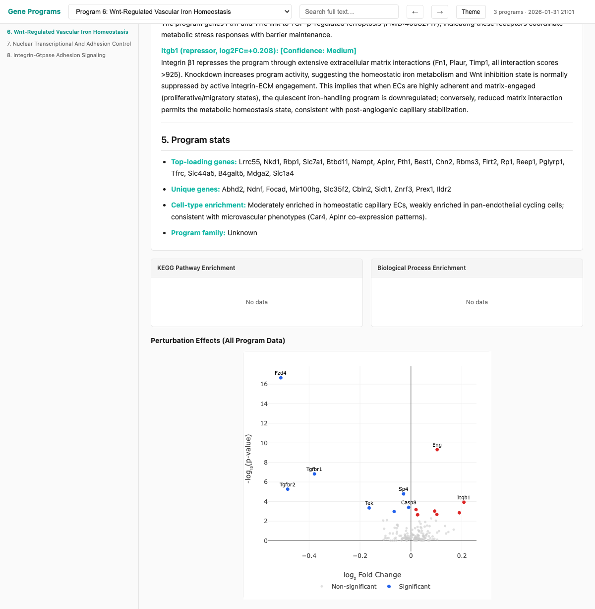

# Gene Program Annotation Pipeline

Automated annotation of gene programs from single-cell data using LLM-based evidence synthesis.

## Overview

### What This Pipeline Does

This pipeline interprets **gene programs** (co-expressed gene modules from cNMF, NMF, or similar methods) by integrating multiple evidence types into structured biological annotations. It solves the challenge of going from raw gene lists to mechanistic understanding at scale.

**Input**: Gene programs from single-cell RNA-seq analysis  
**Output**: Structured biological annotations with functional modules, cell-type context, and regulatory mechanisms

### Why LLM-Based Annotation?

Gene program interpretation traditionally requires manual literature review and expert knowledge. This pipeline automates that process by:

1. **Evidence-first approach**: Gathers functional enrichment, literature, cell-type enrichment, and regulator data *before* LLM analysis
2. **Structured prompts**: Forces LLM to cite genes for every claim, preventing hallucination
3. **Batch processing**: Annotates 100+ programs consistently using the same evidence framework
4. **Multi-modal integration**: Combines pathway databases (STRING), literature (PubMed), experimental data (Perturb-seq), and cell-type markers in one analysis

### Design

**Primary evidence = Gene lists**. All other data (enrichment, literature, regulators) serves as *cross-validation* only. The LLM must ground every biological claim in the actual genes provided.

**Strict output format**. LLM responses follow a structured template with:
- Brief summary (1-2 sentences)
- Specific program label (≤6 words, no generic terms)
- High-level overview (≤120 words, each claim cites ≥2 genes)
- Functional modules (3-5 modules with mechanisms)
- Regulator analysis (mechanistic hypotheses)

**Reproducibility**. All API calls are cached, prompts are version-controlled, and batch submissions create audit trails.

## Pipeline Flow


The pipeline has 4 major zones:

1. **Input Data Sources** (left): Gene loading, STRING enrichment, SCEPTRE results, cell-type annotations
2. **Processing & Retrieval** (middle-left): Filter top/unique genes, fetch literature, validate regulators
3. **Synthesis Engine** (middle-right): Assemble context into structured prompts, submit to LLM batch API
4. **Output Requirements** (right): Parse structured annotations into markdown, CSV, and interactive HTML

## Quick Start

Run the full pipeline with a configuration file:

```bash
python pipeline/run_pipeline.py --config configs/pipeline_config.yaml
```

Or specify inputs directly:

```bash
python pipeline/run_pipeline.py \
  --gene-loading input/genes/FB_moi15_seq2_loading_gene_k100_top300.csv \
  --celltype-enrichment input/celltype/fp_seq2_cnmf_celltype_l2_program_enrichment.csv \
  --regulator-file input/regulators/sceptre_discovery_analysis_results.csv \
  --output-dir results/output/my_run
```

Test with specific topics (faster):

```bash
python pipeline/run_pipeline.py --config configs/pipeline_config.yaml --topics 5,6,8,11,18
```

## Input Compatibility

**The pipeline works with diverse input formats!** Column names are **case-insensitive** and support common variants:

- **Gene names**: `Name`, `Gene`, `gene_name`, `GeneName`, `Symbol` → all work
- **Scores**: `Score`, `Loading`, `Weight`, `Value` → all work  
- **Program IDs**: `program_id`, `RowID`, `topic`, `Topic`, `component` → all work
- **Cell types**: `cell_type`, `celltype`, `cluster`, `Cluster` → all work
- **Log2 fold change**: `log2_fc`, `log2FC`, `log2_fold_change`, `lfc` → all work
- **FDR/p-values**: `fdr`, `FDR`, `p_adj`, `padj`, `qvalue` → all work

This means your cNMF output, Seurat cluster results, or other standard formats will work without modification.

## Prerequisites

### Environment Setup

Install dependencies using conda:

```bash
conda env create -f configs/environment.yaml
conda activate progexplorer
```

Or manually install: `pandas`, `requests`, `numpy`, `markdown`, `pyyaml`, `anthropic`, `matplotlib`, `seaborn`, `tqdm`, `pillow`

### API Keys

Set environment variables in `.env`:

- `ANTHROPIC_API_KEY` (required for LLM annotations)
- `NCBI_API_KEY` (optional, increases PubMed rate limits)

### Optional: Vertex AI

For Vertex AI backend instead of Anthropic:
- Install Google Cloud SDK
- Configure appropriate GCP permissions

## Required Inputs

The pipeline needs 3 input files. **Column names are flexible and case-insensitive** for maximum compatibility with different analysis pipelines.

| File | Description | Supported Column Names |
|------|-------------|------------------------|
| **Gene loading** | Gene loading matrix from cNMF or similar | **Gene**: Name, Gene, gene_name, GeneName, gene_symbol, Symbol<br>**Score**: Score, Loading, Weight, Value<br>**Program ID**: program_id, RowID, topic, Topic, component |
| **Cell-type enrichment** | Cell-type enrichment results | **Cell type**: cell_type, celltype, cluster, Cluster, annotation<br>**Program**: program, program_id, topic, Topic, RowID<br>**Log2 FC**: log2_fc, log2FC, log2_fold_change, lfc, fold_change<br>**FDR**: fdr, FDR, p_adj, padj, p_value, qvalue |
| **Regulator file** | SCEPTRE or Perturb-seq regulator results | Standard SCEPTRE output format |

**Example formats that work:**

```python
# Gene loading - All these work:
Name, Score, program_id      # Standard
Gene, Loading, RowID         # Alternative 1
gene_name, score, Topic      # Alternative 2
GENE, SCORE, topic_id        # Case-insensitive

# Cell-type enrichment - All these work:
cell_type, program, log2_fc_in_vs_out, fdr    # Standard
cluster, topic, log2FC, p_adj                  # Alternative 1
CellType, Program, Log2FoldChange, FDR         # Alternative 2
Cluster, RowID, lfc, qvalue                    # Alternative 3
```

**Note**: Program identifiers support flexible formats: `Program_<id>`, `program_<id>`, `Topic_<id>`, `topic_<id>`, `P_<id>`, `p_<id>`, or plain integers.

## Configuration

Edit `configs/pipeline_config.yaml` to set inputs and parameters:

```yaml
input:
  gene_loading: input/genes/FB_moi15_seq2_loading_gene_k100_top300.csv
  celltype_enrichment: input/celltype/fp_seq2_cnmf_celltype_l2_program_enrichment.csv
  regulator_file: input/regulators/sceptre_discovery_analysis_results.csv

output_dir: results/output/pipeline_run

topics: null  # null = all topics, or list specific: [5, 6, 8, 11, 18]
species: 10090  # 10090 = mouse, 9606 = human
context: '(endothelial OR endothelium OR "vascular endothelial")'

llm_backend: anthropic  # "anthropic" or "vertex"
llm_model: claude-sonnet-4-5-20250929
llm_max_tokens: 8192
llm_wait: true  # Wait for batch to complete
```

## Pipeline Steps

The pipeline runs 6 steps automatically:

1. **String enrichment** - Extract top genes, compute UniquenessScore, run STRING enrichment, generate cell-type summary
2. **Literature fetch** - Fetch Harmonizome gene summaries and PubMed literature (25 papers/program)
3. **Batch prepare** - Generate LLM prompts with all evidence
4. **Batch submit** - Submit to Anthropic or Vertex AI batch API
5. **Parse results** - Extract LLM annotations and generate summary
6. **HTML report** - Create interactive HTML report with figures

### Why These Steps?

**Step 1** creates the primary evidence (gene lists) and computes UniquenessScore to identify genes that distinguish one program from others. STRING enrichment provides pathway context as a cross-check.

**Step 2** fetches literature to support or challenge pathway predictions. The "Search Narrow, Verify Broad" strategy finds papers mentioning driver genes (top 20), then scores them by coverage of all program genes (top 300).

**Step 3** assembles evidence into structured prompts. The prompt template enforces citation rules: every biological claim must cite specific genes from the provided lists.

**Step 4** uses batch APIs for cost-efficiency and consistent processing. Anthropic Batch API is default (faster, simpler). Vertex AI option available for GCP users.

**Step 5** parses LLM responses into structured markdown and extracts program labels/summaries into CSV for downstream analysis.

**Step 6** generates an interactive HTML report with search, volcano plots, and enrichment figures for human review.

## Partial Pipeline Runs

Stop at a specific step:

```bash
# Prepare batch without submitting
python pipeline/run_pipeline.py --config configs/pipeline_config.yaml --stop-after batch_prepare
```

Resume from a specific step:

```bash
# Resume from parsing (Anthropic)
python pipeline/run_pipeline.py --config configs/pipeline_config.yaml --start-from parse_results

# Resume from parsing (Vertex AI - requires GCS prefix)
python pipeline/run_pipeline.py --config configs/pipeline_config.yaml \
  --start-from parse_results \
  --gcs-prefix gs://bucket/batch/prediction-model-<timestamp>/
```

Available step names: `string_enrichment`, `literature_fetch`, `batch_prepare`, `batch_submit`, `parse_results`, `html_report`

## Automatic Resume (Batch Jobs)

For asynchronous batch workflows (when `llm_wait: false`), the pipeline supports automatic resume:

```bash
# First run: submits batch and exits
python pipeline/run_pipeline.py --config configs/pipeline_config.yaml
# → Steps 1-4 complete, batch submitted
# → "Batch submitted (msgbatch_xxx). Rerun this command later..."

# Later: same command resumes automatically
python pipeline/run_pipeline.py --config configs/pipeline_config.yaml
# → Skips completed steps
# → Checks batch status, downloads results when ready
# → Continues with parse_results and html_report
```

The pipeline state is stored in `<output_dir>/pipeline_state.json`. On resume:
- Completed steps are automatically skipped
- Pending batch jobs are checked and downloaded when ready
- If the batch is still processing, the pipeline exits cleanly (rerun later)

**Note:** The config hash excludes `llm_wait` and `resume` settings, so you can change these between runs without invalidating the saved state.

## Output Structure

```
results/output/my_run/
├── genes_top.json                      # Program → gene list mapping
├── gene_loading_with_uniqueness.csv    # Gene table with UniquenessScore
├── celltype_summary.csv                # Auto-generated cell-type summary
├── literature_context.json             # Gene summaries & literature
├── string_enrichment/
│   ├── enrichment_filtered.csv         # Process/KEGG enrichment terms
│   └── figures/                        # Enrichment bar charts (PNG)
├── llm_batches/
│   ├── batch_request.json              # LLM prompts
│   └── batch_request_results.jsonl     # LLM responses
└── annotations/
    ├── topic_*_annotation.md           # Per-topic annotations
    ├── summary.csv                     # Topic names and summaries
    └── report.html                     # Interactive HTML report
```

## Example Outputs

### STRING Enrichment Figures (Step 1)

The pipeline generates pathway and biological process enrichment visualizations for each program:

**Biological Process (Gene Ontology) Enrichment:**


**KEGG Pathway Enrichment:**


### Interactive HTML Report (Final Output)

The final HTML report provides a searchable, navigable interface for all program annotations:

**Program Overview with Key Statistics:**



**Detailed Functional Modules and Mechanisms:**



**Perturbation Analysis with Interactive Volcano Plot:**



**Key Features:**
- **Program selector**: Dropdown to quickly switch between annotated programs
- **Full-text search**: Search across all annotations for genes, pathways, or biological terms
- **Navigation sidebar**: Quick links to each program annotation
- **Interactive visualizations**: Plotly-powered volcano plots showing regulator effects
- **Enrichment integration**: Display of STRING enrichment results alongside annotations
- **Dark/light theme**: Toggle for comfortable viewing

## Advanced Options

### Use Full Gene Summaries

By default, short Harmonizome descriptions are used. For longer summaries with PMID references:

```yaml
full_summaries: true  # In config
```

Or:

```bash
python pipeline/02_fetch_ncbi_data.py ... --full-summaries
```

### Switch LLM Backend

**Anthropic (default):**

```yaml
llm_backend: anthropic
```

```bash
# Manual batch operations
python pipeline/03_submit_and_monitor_batch.py submit batch_request.json --wait
python pipeline/03_submit_and_monitor_batch.py check --batch-id <BATCH_ID>
python pipeline/03_submit_and_monitor_batch.py results --batch-id <BATCH_ID>
```

**Vertex AI:**

```yaml
llm_backend: vertex
```

```bash
python pipeline/03_submit_and_monitor_batch.py submit-vertex batch_request.json --wait
python pipeline/03_submit_and_monitor_batch.py check-vertex --job-name <JOB_NAME>
```

### Run Individual Scripts

For debugging or custom workflows, run pipeline steps independently:

```bash
# Step 1: STRING enrichment + cell-type summary
python pipeline/01_genes_to_string_enrichment.py all \
  --input input/genes/FB_moi15_seq2_loading_gene_k100_top300.csv \
  --celltype-enrichment input/celltype/fp_seq2_cnmf_celltype_l2_program_enrichment.csv \
  --topics 5,6,8

# Step 2: Literature fetch
python pipeline/02_fetch_ncbi_data.py \
  --input results/output/gene_loading_with_uniqueness.csv \
  --json-out results/output/literature_context.json \
  --topics 5,6,8

# Step 3: Prepare batch
python pipeline/03_submit_and_monitor_batch.py prepare \
  --gene-file results/output/gene_loading_with_uniqueness.csv \
  --celltype-file results/output/celltype_summary.csv \
  --output-file results/output/batch_request.json
```

Use `--help` on any script for full options.

## Troubleshooting

**Column name errors**: The pipeline now supports flexible, case-insensitive column names. If you still get column errors, check that your file contains gene names, scores/loadings, and program identifiers in some form. Run `python tests/test_column_mapper.py` to see supported column name variants.

**Program ID format errors**: Program identifiers support many formats: `Program_5`, `program_5`, `Topic_5`, `topic_5`, `P_5`, `p_5`, `5_5` (regulator files), `Program5`, `Topic5`, `55`, or plain `5`. The pipeline will automatically parse these.

**API rate limits**: Set `NCBI_API_KEY` for higher PubMed throughput. Anthropic batch API has no rate limits.

**Missing dependencies**: Run `conda env create -f configs/environment.yaml` or manually install packages listed in Prerequisites.

**Input file compatibility**: Example input files are provided in the `input/` directory:
- `input/genes/FB_moi15_seq2_loading_gene_k100_top300.csv` - Gene loading example
- `input/celltype/fp_seq2_cnmf_celltype_l2_program_enrichment.csv` - Cell-type enrichment example
- `input/regulators/sceptre_discovery_analysis_results.csv` - SCEPTRE results example
