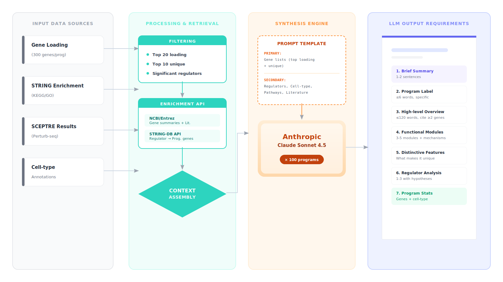
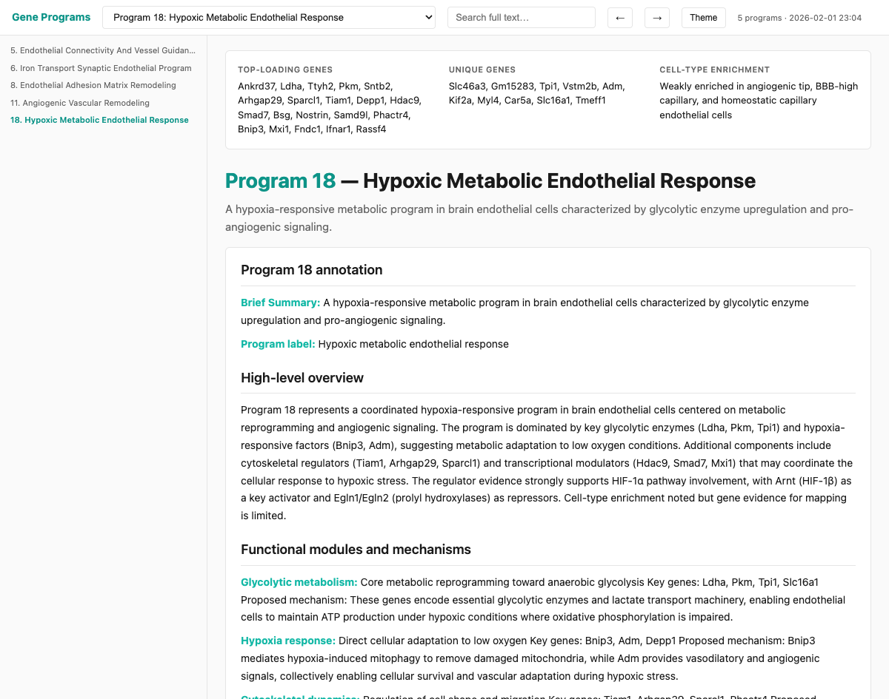
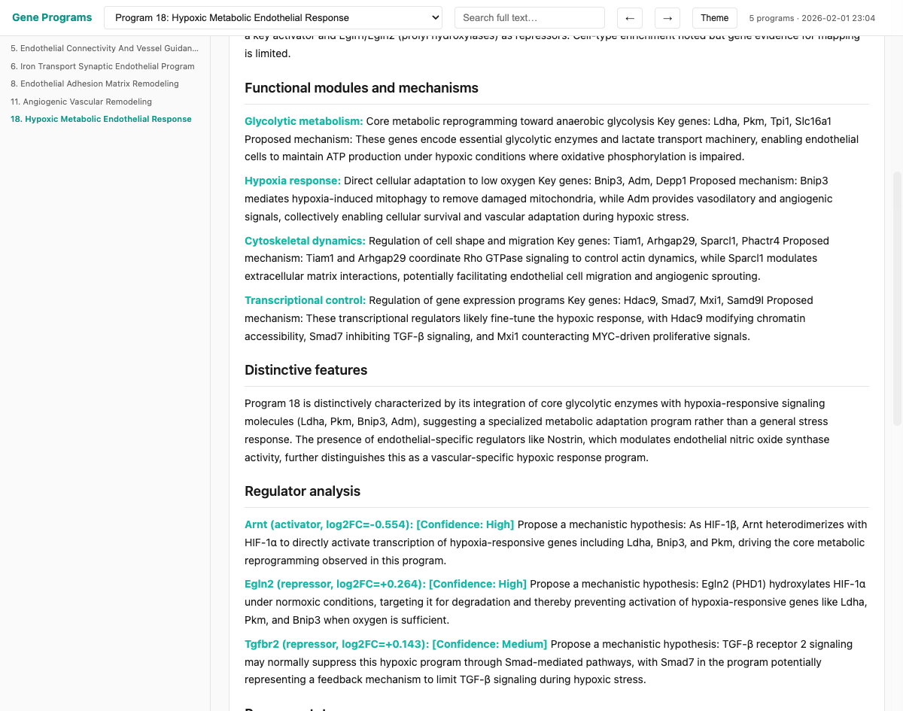

# Gene Program Annotation Pipeline

Automated annotation of gene programs from single-cell data using LLM-based evidence synthesis.

## Overview

This pipeline interprets **gene programs** (co-expressed gene modules from cNMF, NMF, etc.) by integrating multiple evidence types into structured biological annotations.

**Input**: Gene programs from single-cell RNA-seq analysis  
**Output**: Structured annotations with functional modules, cell-type context, and regulatory mechanisms

### Why LLM-Based Annotation?

Gene program interpretation traditionally requires manual literature review and expert knowledge. This pipeline automates that process through:

1. **Evidence-first approach**: Gathers gene summaries, pathway enrichment, literature, and regulators *before* LLM analysis
2. **Citation-enforced prompts**: LLM must cite specific genes for every biological claim to prevent hallucination
3. **Batch processing**: Annotates 100+ programs consistently using the same evidence framework

### Design

**Primary evidence = Gene lists**. All other data (enrichment, literature, regulators) serves as cross-validation. The LLM must ground every biological claim in the actual gene summaries provided.

**Structured output format**: LLM responses follow a strict template with brief summaries, specific program labels (≤6 words), functional modules, and regulator analysis.

**Reproducibility**: All API calls are cached, prompts are version-controlled, and batch submissions create audit trails.



## Getting Started

### 1. Clone and Install

```bash
git clone <repository-url>
cd ProgExplorer
conda env create -f configs/environment.yaml
conda activate progexplorer
```

### 2. Set API Keys

Create a `.env` file in the project root:

```bash
ANTHROPIC_API_KEY=sk-ant-...your-key-here
NCBI_API_KEY=your-ncbi-key  # Optional, for higher PubMed rate limits
```

Get your Anthropic API key from https://console.anthropic.com/ or request a lab AI API Gateway through your institution (recommended for labs, see https://uit.stanford.edu/service/ai-api-gateway).

### 3. Prepare Your Data

You need **3 input files** (see `input/` directory for examples):
1. **Gene loading matrix** - Required
2. **Cell-type enrichment** - Required  
3. **Regulator/Perturb-seq results** - Required (if unavailable, use a placeholder or modify the pipeline)

**Check your data format**: The pipeline accepts case-insensitive column names (e.g., `Name`/`Gene`, `Score`/`Loading`, `program_id`/`topic`). Most cNMF and Seurat outputs work without modification.

### 4. Configure

Edit `configs/pipeline_config.yaml` to point to YOUR data:

```yaml
input:
  gene_loading: path/to/your/gene_loading.csv           # YOUR file here
  celltype_enrichment: path/to/your/celltype_enrich.csv # YOUR file here
  regulator_file: path/to/your/regulators.csv           # YOUR file here

output_dir: results/output/my_analysis  # Where results will be saved
```

### 5. Run

```bash
# Full pipeline
python pipeline/run_pipeline.py --config configs/pipeline_config.yaml

# Test with specific topics first (recommended)
python pipeline/run_pipeline.py --config configs/pipeline_config.yaml --topics 5,6,8
```

The pipeline takes ~5-30 minutes depending on the number of programs and whether you're waiting for LLM batch completion (`llm_wait: true`).

## Input Files

The pipeline requires 3 input files. **Column names are case-insensitive** and support common variants.

| File | Required Columns | Notes |
|------|------------------|-------|
| **Gene loading** | `Name` (gene symbol), `Score` (loading/weight), `program_id` (topic ID) | Your cNMF/NMF output. Column names flexible: `Gene`/`gene_name`, `Loading`/`Weight`, `RowID`/`topic` all work |
| **Cell-type enrichment** | `cell_type`, `program`, `log2_fc`, `fdr` | From scanpy, Seurat, or similar. Alternatives: `cluster`, `topic`, `lfc`, `p_adj` |
| **Regulator file** | `grna_target`, `log_2_fold_change`, `p_value`, `significant` | SCEPTRE or Perturb-seq results. Used for volcano plots and mechanistic analysis |

**Validation**: Check example files in `input/` directory match your format. Test with `--topics 5,6,8` first to catch format issues quickly.

**Automatically fetched** (no input needed): Gene summaries (Harmonizome/NCBI) and PubMed literature are retrieved in Step 2.

## Configuration

Key settings in `configs/pipeline_config.yaml`:

```yaml
input:
  gene_loading: path/to/your/gene_loading.csv          # CHANGE THIS
  celltype_enrichment: path/to/your/enrichment.csv     # CHANGE THIS
  regulator_file: path/to/your/regulators.csv          # CHANGE THIS

output_dir: results/output/my_run  # Output location

topics: null        # null = all programs, or [5, 6, 8] for specific ones
species: 10090      # 10090 = mouse, 9606 = human
context: '(endothelial OR endothelium)'  # PubMed search context for your tissue/cell type

llm_backend: anthropic  # "anthropic" (default) or "vertex"
llm_wait: true          # true = wait for completion, false = async (resume later)
```

**Optional**: Use `full_summaries: true` for longer gene descriptions with PMID references (~2000 chars vs ~400 chars default).

**Vertex AI setup**: If using `llm_backend: vertex`, install Google Cloud SDK and set `vertex_bucket: gs://your-bucket/path`.

## Pipeline Steps

1. **String enrichment** - Extract top genes, compute UniquenessScore, run STRING pathway enrichment
2. **Literature fetch** - Fetch gene summaries (Harmonizome/NCBI) and PubMed literature (25 papers/program)
3. **Batch prepare** - Generate structured LLM prompts with all evidence and citation requirements
4. **Batch submit** - Submit to Anthropic or Vertex AI batch API
5. **Parse results** - Extract annotations into markdown and CSV
6. **HTML report** - Generate interactive report with search and visualizations

### Why These Steps?

**Step 1** creates primary evidence (gene lists) and computes UniquenessScore to identify genes distinguishing each program. STRING enrichment provides pathway context as cross-validation.

**Step 2** implements "Search Narrow, Verify Broad": finds papers mentioning driver genes (top 20), then scores them by coverage of all program genes (top 300). Gene summaries provide foundational biological context.

**Step 3** assembles evidence into structured prompts with strict citation rules: every biological claim must cite specific genes from the provided lists.

**Steps 4-6** use batch APIs for cost-efficiency, parse structured responses, and generate interactive reports for human review.

## Partial & Resume Runs

**Stop early**: Use `--stop-after batch_prepare` to prepare prompts without submitting to LLM (useful for reviewing prompts first).

**Resume from checkpoint**: Use `--start-from parse_results` to skip to a specific step (e.g., if batch completed externally).

**Available steps**: `string_enrichment`, `literature_fetch`, `batch_prepare`, `batch_submit`, `parse_results`, `html_report`

**Async workflow** (recommended for large datasets):
1. Set `llm_wait: false` in config
2. Run pipeline → exits after batch submission
3. Wait for email notification or check status manually
4. Rerun same command → automatically resumes from where it left off

Pipeline state is saved in `<output_dir>/pipeline_state.json`. Completed steps are always skipped.

## Output Structure

```
results/output/my_run/
├── genes_top.json                      # Program → gene list mapping
├── gene_loading_with_uniqueness.csv    # Gene table with UniquenessScore
├── celltype_summary.csv                # Auto-generated cell-type summary
├── literature_context.json             # Gene summaries & literature
├── string_enrichment/
│   ├── enrichment_filtered.csv         # Process/KEGG enrichment terms
│   └── figures/                        # Enrichment bar charts (PNG)
├── llm_batches/
│   ├── batch_request.json              # LLM prompts
│   └── batch_request_results.jsonl     # LLM responses
└── annotations/
    ├── topic_*_annotation.md           # Per-topic annotations
    ├── summary.csv                     # Topic names and summaries
    └── report.html                     # Interactive HTML report
```

## Example Outputs

**STRING Enrichment** (Step 1):

 

**Interactive HTML Report** (Final Output):



*Example: Program 18 (Hypoxic Metabolic Endothelial Response) showing overview, functional modules (glycolytic metabolism, hypoxia response), and mechanistic analysis.*



*Detailed view of functional modules showing cytoskeletal dynamics, transcriptional control mechanisms, and regulator analysis.*


*Bottom section showing KEGG/Biological Process enrichment figures (HIF-1 signaling, hypoxia response) and interactive volcano plot highlighting key regulators (Arnt, Egln2, Eng).*

Features: Program selector, full-text search, interactive volcano plots, enrichment figures, dark/light theme.

## Advanced Options

**Gene summaries**: Default uses short Harmonizome API summaries (~400 chars). Set `full_summaries: true` for longer summaries with PMIDs (~2000 chars), or use `gene_summary_source: ncbi` for NCBI Entrez descriptions.

**LLM backend**: Default is Anthropic. Set `llm_backend: vertex` for Vertex AI (requires GCS bucket).

**Individual scripts**: Run `python pipeline/0X_*.py --help` to execute steps independently for debugging.

## Troubleshooting

**"File not found" errors**: Check that paths in your config are correct and files exist.

**Column name errors**: The pipeline auto-detects column names (case-insensitive). If you get column errors, verify your file has gene names, scores, and program IDs. Run `python tests/test_column_mapper.py` to see all supported column name variants.

**API key errors**: 
- Anthropic: Check `.env` file exists in project root with `ANTHROPIC_API_KEY=sk-ant-...`
- Test with: `python -c "import os; from dotenv import load_dotenv; load_dotenv(); print(os.getenv('ANTHROPIC_API_KEY')[:20])"`

**Batch not completing**: If `llm_wait: true` times out, set `llm_wait: false` and rerun later to check status and download results.

**Want to test format first?**: Run with `--topics 5,6,8` to process just 3 programs before running the full dataset.

**Example formats**: See `input/` directory for reference file formats that match the expected structure.
